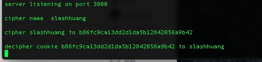

# koa-cookie-cipher-middleware

> simple cookie cipher middleware for koa2.

## Installation

```bash
    npm install koa-cookie-cipher-middleware
```

## Usage
> [use case](./test/test.js)
```javascript

    const app = new Koa();
    const Cipher = require('koa-cookie-cipher-middleware');
    const PORT = 3000;
    const TestMiddleware = async function(ctx,next) {
        console.log(`cipher name  slashhuang\n`);
        let cookieCipher = await ctx.cookie_decoder.cipher('slashhuang')
        console.log(`cipher slashhuang to ${cookieCipher}\n`);
        let cookieDecipher = await ctx.cookie_decoder.decipher('slashhuang');
        console.log(`decipher cookie ${cookieCipher} to ${cookieDecipher}`);
    }
    const MiddlewareArr = [ Cipher('hello'),TestMiddleware ];
    app.use(Compose(MiddlewareArr));
    app.listen(PORT);

```

## demo page


## Author
slashhuang

##License
MIT